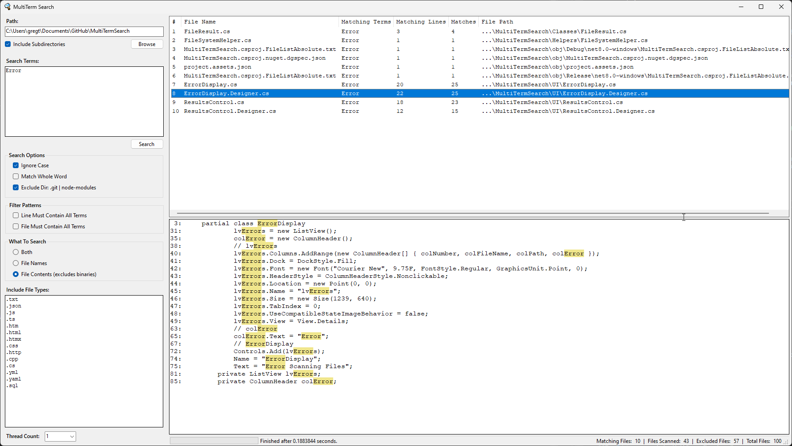
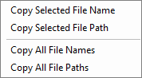

# MultiTermSearch
A quick and dirty search tool for searching a file system for files that contain one or more search terms.

The list of files list allows you to export some of the data via a right-click context menu:

## Notes on use
### Search Term
- The field allows for multiple lines of data.
- Each new line will be treated as a separate word to search for.
- All search terms are turned into their own unique precompiled regex searches for efficiency... so if you choose to 'Match Whole Word' beware that it is already wrapping the terms in a `\b` tags.

### Include File Types
- The field allows for multiple lines of data as well.
- Each line is an additional file type that will be include in the search.
- The file types must begin with a `.`
- To search for all file types just set the field to:  `.*`

### Thread Count
- Unless you plan on scanning files that are hundreds of MB or GB in size there is little benefit in increasing the field, but if your file sizes are large it can help the search keep moving while one thread is stuck working on a large file.

## Plans for future updates
- Add an option to filter out binary file types from the wildcard search.
- Add a way to exclude file types when the `.*` option is entered in the **Include File Types** field.
- Add a Regex option to the **Search Options** section that allows the user to enter in their entirely own regex string.
